# EDTA-Audit: Taxonomy-Aware Quality Control Framework for EDTA Annotations

[](https://github.com/DiLiu-Lab/EDTA-Audit-Tool/actions) 

**EDTA-Audit** is a post-processing Quality Control (QC) framework developed to validate *de novo* Transposable Element (TE) annotations generated by [EDTA](https://github.com/oushujun/EDTA).

Unlike generic validation scripts that rely solely on file existence, this tool implements **taxonomy-aware biological thresholds**. It is designed to distinguish valid biological variation from assembly artifacts or pipeline failures by applying lineage-specific metrics derived from genomic benchmarks.

## Citation

If you utilize this software in your research, please cite:

> **Liu, D.**, et al. (2026). **EDTA-Audit: A Taxonomy-Aware Quality Control Framework for Automated Transposable Element Annotation**. *Source Code*. https://github.com/DiLiu-Lab/EDTA-Audit-Tool

## Methodology: Biological Thresholds

The quality control logic relies on lineage-specific genomic characteristics derived from literature benchmarks. The tool enforces the following empirically determined thresholds:

| Metric | Plant Mode (Strict) | Animal Mode (Standard) | Fungi Mode (Adaptive) |
| :--- | :--- | :--- | :--- |
| **Total TE Content** | **> 20.0%** | **> 5.0%** | **> 1.0%** |
| **LTR Library Size** | **> 500 KB** | > 10 KB | > 5 KB |
| **LINE Library Size** | > 30 KB | **> 50 KB** | > 1 KB |
| **Library Integrity** | Strict | Strict | Adaptive (Allows Missing) |

> **Rationale for Thresholds:**
> * **Plants:** The 20% lower bound is conservative for angiosperms; values below this significantly deviate from model organisms (e.g., *Arabidopsis thaliana* ~21%; Quesneville 2020) and typically indicate assembly collapse.
> * **Animals:** Thresholds are adjusted for compact vertebrate genomes (e.g., Avian genomes ~5-10%; Zhang et al. 2014) while strictly enforcing LINE integrity, which is crucial for mammalian genome evolution (Sotero-Caio et al. 2017).
> * **Fungi:** Adaptive logic tolerates the natural absence of specific superfamilies (e.g., SINEs) as documented in fungal genomics (Castanera et al. 2016).

### Logic Workflow

```mermaid
graph LR
    Input[EDTA Results] --> Check{Species?}
    
    %% Plant Path
    Check -- plant --> Plant[🌱 Plant Mode]
    Plant --> P_Check{Thresholds}
    P_Check -- "TE<20% / LTR<500KB" --> Fail_P[❌ Fail]
    P_Check -- "Metrics OK" --> Pass_P[✅ Pass]
    
    %% Animal Path
    Check -- animal --> Animal[🐅 Animal Mode]
    Animal --> A_Check{Thresholds}
    A_Check -- "TE<5% / No LINEs" --> Fail_A[❌ Fail]
    A_Check -- "Metrics OK" --> Pass_A[✅ Pass]
    
    %% Fungi Path
    Check -- fungi --> Fungi[🍄 Fungi Mode]
    Fungi --> F_Check{Thresholds}
    F_Check -- "TE<1%" --> Fail_F[❌ Fail]
    F_Check -- "SINEs Optional" --> Pass_F[✅ Pass]

    %% Styles
    style Fail_P fill:#ffe6e6,stroke:#ff0000,stroke-width:1px
    style Fail_A fill:#ffe6e6,stroke:#ff0000,stroke-width:1px
    style Fail_F fill:#ffe6e6,stroke:#ff0000,stroke-width:1px
    
    style Pass_P fill:#e6ffe6,stroke:#00aa00,stroke-width:1px
    style Pass_A fill:#e6ffe6,stroke:#00aa00,stroke-width:1px
    style Pass_F fill:#e6ffe6,stroke:#00aa00,stroke-width:1px
```



## Validation and Reproducibility

To ensure the reliability of the QC metrics, we validated EDTA-Audit using both synthetic datasets and real-world genomes.

## 📊 Benchmarking & Validation

The framework was rigorously benchmarked against **13 public plant genome assemblies** (NCBI RefSeq/GenBank) spanning diverse quality levels. 

EDTA-Audit successfully distinguished high-quality assemblies from those with anomalously low LINE content (<30 KB), demonstrating higher specificity than generic file existence checks.

### 🏆 Key Results
| Accession | Species | Total TE (%) | LTR Size | LINE Size | Audit Result |
| :--- | :--- | :--- | :--- | :--- | :--- |
| **GCF_001879475.1** | *Ipomoea nil* | 61.28% | 16 MB | 102 KB | ✅ **PASS** |
| **GCF_048772165.1** | *Typha angustifolia* | 26.20% | 793 KB | 53 KB | ✅ **PASS** |
| **GCF_019578655.1** | *Ricinus communis* | 40.46% | 3.1 MB | 22 KB | ❌ **FAIL (Low LINEs)** |
| **GCF_009805555.1** | *Andrographis paniculata* | 38.27% | 2.9 MB | 27 KB | ❌ **FAIL (Low LINEs)** |

*(See the full list of 13 genomes in `benchmarking/accession_ids.txt`)*

### 🔄 How to Reproduce
You can reproduce these results by downloading the exact datasets used in our paper:

1. **Download the Accession List:**
   The full list of IDs is provided in this repository: [benchmarking/accession_ids.txt](benchmarking/accession_ids.txt)

2. **Fetch Data (using NCBI Datasets):**
   ```bash
   datasets download genome accession --inputfile benchmarking/accession_ids.txt --include genome

## Installation

### Requirements
* Linux or macOS
* Bash (v4.0+)
* **No external dependencies**

### Setup
```bash
git clone [https://github.com/DiLiu-Lab/EDTA-Audit-Tool.git](https://github.com/DiLiu-Lab/EDTA-Audit-Tool.git)
cd EDTA-Audit-Tool
chmod +x edta_audit.sh generate_validation_set.sh
```

## Usage
## 🖥️ Output Preview

Here is a real-world demonstration running on **13 NCBI Angiosperm assemblies**. 
The tool is executed in **Plant Mode** with automatic sorting flags (`-m` and `-x`) enabled:


### Basic Command
```bash
./edta_audit.sh -d <input_directory> -t <type> [options]
```

### Parameters

| Flag | Description | Default |
| :--- | :--- | :--- |
| **-d** | Path to input directory (recursive search enabled). | **Required** |
| **-t** | Organism type. Options: `plant`, `animal`, `fungi`. | `other` |
| **-o** | Output file for FAILED samples. | `edta_failed_list.txt` |
| **-p** | Output file for PASSED samples. | `edta_passed_list.txt` |
| **-m** | Move PASSED folders to a specific directory (Data Management). | Disabled |
| **-x** | Move FAILED folders to a specific directory (Quarantine). | Disabled |
| **-O** | **Organize Mode**: Aggressively scan and merge scattered file structures. | Disabled |
| **-q** | **Quiet Mode**: Suppress standard terminal output. | Disabled |

### Example: Workflow Integration
Audit a large directory of maize genomes, quarantine failed samples, and log results quietly:

```bash
./edta_audit.sh -d ./raw_data -t plant -x ./Quarantine_Failures -q
```

## License

This project is licensed under the MIT License - see the LICENSE file for details.

## References

1. Quesneville, H. **Twenty years of transposable element analysis in the Arabidopsis thaliana genome.** *Mobile DNA* 11, 28, doi:10.1186/s13100-020-00223-x (2020).
2. Sotero-Caio, C. G., Platt, R. N., II, Suh, A. & Ray, D. A. **Evolution and Diversity of Transposable Elements in Vertebrate Genomes.** *Genome Biology and Evolution* 9, 161-177, doi:10.1093/gbe/evw264 (2017).
3. Castanera, R. et al. **Transposable Elements versus the Fungal Genome: Impact on Whole-Genome Architecture and Transcriptional Profiles.** *PLOS Genetics* 12, e1006108, doi:10.1371/journal.pgen.1006108 (2016).
4. Zhang, G. et al. **Comparative genomics reveals insights into avian genome evolution and adaptation.** *Science* 346, 1311-1320, doi:10.1126/science.1251385 (2014).


